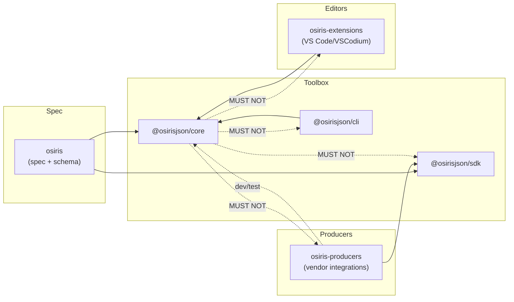

# OSIRIS JSON Architecture Development Guidelines<!-- omit in toc -->
| Field     | Value |
| --------- | ----- |
| Authors   | Tia Zanella [skhell](https://github.com/skhell) |
| Revision  | 1.0.0-DRAFT |
| Creation date      | 04 February 2026 |
| Last revision date | 05 February 2026 |
| Status    | Draft |
| Specification ID | OSIRIS-1.0 |
| Specification URI | [OSIRIS-1.0](https://github.com/osirisjson/osiris/tree/main/specification/v1.0/OSIRIS-JSON-v1.0.md) |
| Schema URI | [OSIRIS-1.0](https://osirisjson.org/schema/v1.0/osiris.schema.json) |
| License   | [CC BY 4.0](https://creativecommons.org/licenses/by/4.0/) |
| Repository | [github.com/osirisjson/osiris](https://github.com/osirisjson/osiris) |


# Table of Content
<!-- wip will be done later -->


# 1 Introduction
This document defines the architectural foundation for the OSIRIS ecosystem. It establishes the patterns, principles and repository structures required to build and evolve the OSIRIS core **toolbox**, **producers** and **extensions** in a sustainable and scalable way.

These Architecture Development Guidelines prioritize:

| Priority | Description |
|---|---|
| Modularity | Components are independent and composable, enabling incremental adoption and isolated evolution |
| Consistency | Shared conventions and interfaces across producers and tools reduce ecosystem fragmentation |
| Quality | Robust validation, reproducible fixtures and CI-driven regression coverage |
| Developer experience | Clear APIs, predictable workflows and documentation that makes contributors productive quickly |
| Extensibility | A stable baseline for adding producers, integrations and validation capabilities without breaking existing workflows |

---

## 1.1 Developer navigation matrix
This document is intentionally lean and focuses on ecosystem **contracts**, **boundaries** and **architectural rules**.  
Implementation details live in focused guides and repository READMEs close to the code.

Use the matrix below to find the right entry point.

| If you are | Reference URI | Will help you |
|---|---|---|
| **New to OSIRIS** | [OSIRIS-ARCHITECTURE](https://github.com/osirisjson/osiris/tree/main/docs/guidelines/v1.0/OSIRIS-ARCHITECTURE.md) | Understand the “why”, ecosystem boundaries and non-negotiable rules |
| Implementing validation logic (rules) | [OSIRIS-VALIDATION-LEVELS](https://github.com/osirisjson/osiris/tree/main/docs/guidelines/v1.0/OSIRIS-VALIDATION-LEVELS.md) | Understand structural/semantic/domain validation and how to add or evolve rules safely |
| Working on a producer (vendor integration) | [OSIRIS-PRODUCER-GUIDELINES](https://github.com/osirisjson/osiris/tree/main/docs/guidelines/v1.0/OSIRIS-PRODUCER-GUIDELINES.md) | Map vendor/platform data into OSIRIS consistently (IDs, resources, relationships, fixtures) |
| Working on editor features (VS Code/VSCodium) | [OSIRIS-EXTENSION-GUIDELINES](https://github.com/osirisjson/osiris/tree/main/docs/guidelines/v1.0/OSIRIS-EXTENSION-GUIDELINES.md) | Consume `@osirisjson/core` diagnostics, implement UX patterns and keep editor performance predictable |
| Working on versioning/releases | [OSIRIS-VERSIONING-AND-RELEASES](https://github.com/osirisjson/osiris/tree/main/docs/guidelines/v1.0/OSIRIS-VERSIONING-AND-RELEASES.md) | Understand compatibility rules, publishing workflow and release alignment with schema versions |
| Working on the CLI | [OSIRIS-TOOLBOX-CLI](https://github.com/osirisjson/osiris-toolbox/tree/main/docs/guidelines/v1.0/OSIRIS-ARCHITECTURE-CLI.md) | Understand command orchestration, output formats and CI-friendly behaviors |
| Working on validation engine internals | [OSIRIS-TOOLBOX-CORE](https://github.com/osirisjson/osiris-toolbox/tree/main/docs/guidelines/v1.0/OSIRIS-ARCHITECTURE-CORE.md) | Understand schema loading, rule execution pipeline, diagnostics model and performance constraints |
| Working on producer SDK internals | [OSIRIS-TOOLBOX-SDK](https://github.com/osirisjson/osiris-toolbox/tree/main/docs/guidelines/v1.0/OSIRIS-ARCHITECTURE-SDK.md) | Understand producer base classes, mapping helpers, ID strategy and shared utilities |
| Unsure where your change belongs | Section “Repository boundaries” in this document | Choose the correct repo/package to avoid duplication and dependency violations |
| Working on the spec/schema itself | [OSIRIS specification](https://github.com/osirisjson/osiris/tree/main/specification/v1.0/OSIRIS-JSON-v1.0.md) | Understand the OSIRIS spec, schema and normative examples |
| Contributing rules & governance | [OSIRIS community](https://osirisjson.org/docs/en/get-involved/community) | Understand how you can contribute to OSIRIS |

---

## 1.2 Architectural principles
### 1.2.1 Single source of truth
OSIRIS is designed to avoid fragmentation. The ecosystem must agree on **one** canonical definition of the format and **one** canonical implementation of validation behavior.

| Single source of truth sources | Non-negotiable rules |
|---|---|
| **OSIRIS specification** in the [OSIRIS](https://github.com/osirisjson/osiris/tree/main/specification/v1.0/OSIRIS-JSON-v1.0.md) repository and served through [osirisjson.org](https://osirisjson.org/docs/en/spec/v10/00-preface) are the authoritative definition of OSIRIS v1.0 | Producers **MUST NOT** store manipulated copies or add incompatible interpretations of the specification |
| **OSIRIS core schema** in the [OSIRIS](https://github.com/osirisjson/osiris/tree/main/schema/v1.0/osiris.schema.json) repository and served through [osirisjson.org](https://osirisjson.org/schema/v1.0/osiris.schema.json) are the authoritative schema for OSIRIS v1.0 | Producers **MUST NOT** store manipulated copies or add incompatible interpretations of the core schema |
| **OSIRIS schema endpoints** (e.g. `/schema/v1.0/`) are canonical for tooling resolution and editor integration | Tooling **SHOULD** prefer `$schema` for resolution when available |
| **OSIRIS validation engine** (`@osirisjson/core`) is the canonical implementation of validation behavior and diagnostic formatting | CLI and editor integrations **MUST NOT** re-implement validation logic that belongs to `@osirisjson/core` |

**Rationale:** a document validated in CI should behave the same in VS Code, in the CLI and in any consumer embedding `@osirisjson/core`. Tooling should work offline (schema may be bundled), but the endpoint remains canonical for versioned resolution.


### 1.2.2 Separation of concerns
OSIRIS splits the ecosystem into clear responsibilities to keep scaling sustainable.

| Roles | Boundaries |
|---|---|
| **Producers** translate source inventories (cloud APIs, on-prem discovery, OT platforms) into **OSIRIS documents** | Producers focus on mapping and data hygiene (identity stability, normalization, redaction) |
| **Core validation** checks documents and emits **diagnostics** (structural, semantic, domain) | `@osirisjson/core` focuses on validation and diagnostics (no vendor APIs, no editor UI, no network calls) |
| **Consumers** (CLI, editors, other tooling) present or act on diagnostics and transform/visualize documents | Consumers focus on UX and automation while delegating validation behavior to `@osirisjson/core` |

**Rationale:** when each layer only does its job, the ecosystem remains predictable and contributors know where changes belong.

---

# 2 Physical architecture
## 2.1 Ecosystem structure
### 2.1.1 Repository layout (Polyrepo vs monorepo)
OSIRIS is developed across multiple repositories under the `osirisjson` GitHub organization. This structure separates **canonical specification content** from **tooling**, **vendor producers** and **editor integrations**, keeping responsibilities clear and enabling the ecosystem to scale as more producers and tools are added.

OSIRIS generated documents are standard **JSON** files and are expected to use the `.json` extension; consumers and toolings detects OSIRIS content via schema metadata and/or document structure rather than a custom file extension.

```text
osirisjson/
├── .github
│   ├── ISSUE_TEMPLATE/
│   ├── workflows/
│   ├── PULL_REQUEST_TEMPLATE.md
│   ├── CODE_OF_CONDUCT.md
│   ├── COMMUNITY_GUIDE.md
│   ├── FUNDING.yml
│   ├── GOVERNANCE.md
│   ├── MEMBERS.md
│   ├── README.md
│   ├── SECURITY.md
│   └── SUPPORT.md
├── osiris                  # Canonical specification, schema sources, guidelines and normative examples
├── osiris-toolbox          # NPM packages: core validation, SDK and CLI
│   ├── core
│   ├── sdk
│   └── cli
├── osiris-producers        # Vendor-specific producers (parsers/exporters)
├── osiris-extensions       # VS Code/VSCodium extension and future integrations
└── osiris-mcp              # Future MCP server
```

### 2.1.2 Repository responsibilities

| osiris | osiris-toolbox | osiris-producers | osiris-extensions | osirisjson.org | .github | osiris-mcp |
|---|---|---|---|---|---|---|
| Canonical OSIRIS JSON specification aligned to released versions | OSIRIS JSON Core validation engine (structural, semantic and domain validation) | Vendor-specific producer implementations (e.g. Cisco NX-OS, Azure) | Real-time OSIRIS JSON validation powered by the shared validation engine | Documentation website and developer resources | Community health files, contribution templates and security/support policies | MCP server implementation for automation and ecosystem integrations |
| Canonical OSIRIS JSON core schema aligned to released versions | OSIRIS JSON Schema validation with enhanced, user-friendly error reporting | Shared producer utilities and fixtures where vendor-specific reuse is needed | Schema-aware autocomplete and navigation | Hosted schema endpoints and downloadable references aligned to released versions | Standardized issue and PR workflows across all repositories | — |
| Docs and guidelines to support development and project grow | Shared error model and diagnostics format consumed by CLI and editor integrations | Integration and regression test suites per producer | Rich diagnostics with actionable messages and quick fixes | — | — | — |
| Normative examples referenced by the specification | OSIRIS JSON TypeScript SDK for producer development (base classes, helpers, builders, ID strategy) | Producer documentation (configuration, permissions, examples) inside each producer package | Future integrations (e.g. draw.io export/preview workflows) | — | — | — |
| Change log and release notes | OSIRIS JSON CLI tool for validation and conversion workflows | — | — | — | — | — |
| — | Utility functions for OSIRIS JSON document manipulation and analysis | — | — | — | — | — |


#### Repository boundaries
Use these rules to avoid duplication and circular dependencies:


- Format definition changes (fields, semantics, namespaces, examples) belong in `osiris`
- Validation behavior changes (rule logic, diagnostics shape) belong in `@osirisjson/core`
- Producer ergonomics (helpers/builders/base classes, fixtures utilities) belong in `@osirisjson/sdk`
- Command UX / CI behavior (flags, exit codes, output formats, orchestration) belong in `@osirisjson/cli`
- Vendor integrations (API calls, auth, inventory mapping, vendor-specific quirks) belong in `osiris-producers`
- IDE UX (language features, UI performance, quick fixes) belong in `osiris-extensions`.

---

## 2.2 The toolbox monorepo (@osirisjson/*)
The toolbox monorepo is the shared foundation of the OSIRIS ecosystem. It provides reusable libraries so that each consumer does not implement its own OSIRIS logic.

### 2.2.1 @osirisjson/core: The validation engine
The purpose is to validate OSIRIS documents and emit deterministic, tool-friendly diagnostics.

| Responsibilities | Non-goals | Typical usage pattern |
|---|---|---|
| Load and apply OSIRIS JSON Schema validation (Level 1 / structural) | No vendor API integrations or inventory fetching | `@osirisjson/cli` |
| Execute semantic integrity checks (Level 2 / referential integrity, uniqueness, format constraints) | No editor UI logic, no CLI orchestration | VS Code/VSCodium extension (directly or through an LSP layer) |
| Execute optional best-practice checks (Level 3 / domain rules) | No network calls during validation (schema resolution must be local/cached) | Third-party tools embedding validation in pipelines |
| Emit diagnostics in a stable data model consumed by CLI and editor integrations | — | — |
| Provide validation profiles (e.g. default vs strict) without changing rule meaning | — | — |


### 2.2.2 @osirisjson/sdk: Producer development kit
The purpose is to provide reusable building blocks to help producers generate high-quality OSIRIS documents consistently.

| Responsibilities | Non-goals | Typical usage pattern |
|---|---|---|
| Base producer patterns (context, logging, scope tracking) | No embedded vendor-specific mapping logic (that belongs in `osiris-producers`) | Producers depend on `@osirisjson/sdk` at runtime |
| Deterministic ID helpers and canonicalization utilities | No “hidden validation fork”: SDK may provide optional preflight checks, but canonical validation is `@osirisjson/core` | Producers may depend on `@osirisjson/core` in dev/test to validate fixtures in CI |
| Builders/helpers to construct resources, connections and groups consistently | — | — |
| Test utilities (fixtures, snapshot testing helpers, regression harness patterns) | — | — |


### 2.2.3 @osirisjson/cli: Command Line Interface
The purpose is to provide a CI-friendly and developer-friendly interface to validate and process OSIRIS documents.

| Responsibilities | Non-goals | Typical usage pattern |
|---|---|---|
| Command orchestration and filesystem IO | No validation re-implementation (always delegate to `@osirisjson/core`) | Local: `npx @osirisjson/cli validate file.json` |
| Invoking `@osirisjson/core` and presenting results | No editor-specific UX assumptions | CI: exit codes + --format json |
| Stable exit codes for CI/CD | — | — |
| Machine-readable output (JSON) and human output (text) | — | — |
| (Optional) conversions that do not change OSIRIS semantics (e.g. formatting, normalization modes) when explicitly requested | — | — |

---

## 2.3 Dependency graph and stability rules
### 2.3.1 The "forbidden direction" rule
OSIRIS packages are layered to prevent circular dependencies and to keep the validation engine portable.
Dependencies **MUST** only flow “down” towards more foundational layers.

- `@osirisjson/core` **MUST NOT** depend on `@osirisjson/sdk`, `@osirisjson/cli`, `osiris-producers`, or any editor integration.
- `@osirisjson/cli` **MAY** depend on `@osirisjson/core`.
- `@osirisjson/sdk` **MUST** remain usable without requiring @osirisjson/cli or editor code.
- osiris-extensions **MUST** delegate validation to `@osirisjson/core` and **MUST NOT** ship incompatible validation logic.
- osiris-producers **MAY** use `@osirisjson/sdk` at runtime and **MAY** use `@osirisjson/core` in tests/CI.

A typical dependency direction looks like this:




### 2.3.2 Version alignment strategy
OSIRIS versioning is designed to keep the ecosystem compatible while allowing evolution.

**Document and schema rules (OSIRIS v1.0)**
- Documents declare `version` as **MAJOR.MINOR.PATCH** (SemVer semantics)
- The v1.0 schema endpoint accepts any `1.x.y` document version
- Producers **MAY** include `$schema`. Other top-level fields **SHOULD NOT** be emitted
- Consumers **MUST** ignore unknown fields for forward compatibility

**Toolbox alignment principles**
- Toolbox packages **MUST** share the same MAJOR version across `@osirisjson/core`, `@osirisjson/sdk` and `@osirisjson/cli`
- `@osirisjson/cli` **MUST** be compatible with the corresponding major of `@osirisjson/core`.
- Producers and extensions **SHOULD** declare which OSIRIS major they support (documentation and/or package metadata)
- Breaking changes to diagnostic shapes, rule identifiers, or CLI contract **MUST** be a toolbox MAJOR bump

**Rationale:** a stable major alignment prevents ecosystem “split brain” where producers, editors and CI disagree on what “valid” means.