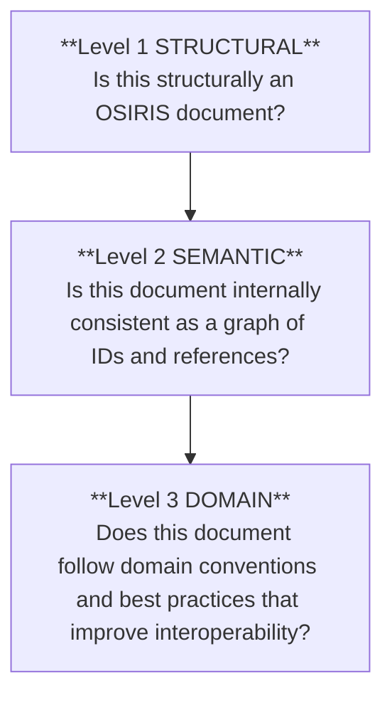

# OSIRIS JSON Validation Levels Guidelines<!-- omit in toc -->
| Field     | Value |
| --------- | ----- |
| Authors   | Tia Zanella [skhell](https://github.com/skhell) |
| Revision  | 1.0.0-DRAFT |
| Creation date      | 08 February 2026 |
| Last revision date | 13 February 2026 |
| Status    | Draft |
| Document ID | OSIRIS-ADG-VL-1.0 |
| Document URI | [OSIRIS-ADG-VL-1.0](https://github.com/osirisjson/osiris/tree/main/docs/guidelines/v1.0/OSIRIS-VALIDATION-LEVELS.md) |
| Document Name | OSIRIS JSON Validation Levels Guidelines |
| Specification ID | OSIRIS-1.0 |
| Specification URI | [OSIRIS-1.0](https://github.com/osirisjson/osiris/tree/main/specification/v1.0/OSIRIS-JSON-v1.0.md) |
| Schema URI | [OSIRIS-1.0](https://osirisjson.org/schema/v1.0/osiris.schema.json) |
| License   | [CC BY 4.0](https://creativecommons.org/licenses/by/4.0/) |
| Repository | [github.com/osirisjson/osiris](https://github.com/osirisjson/osiris) |


# Table of Content
- [Table of Content](#table-of-content)
- [1 Hierarchy of validity](#1-hierarchy-of-validity)
  - [1.1 Level 1: Structural (JSON schema)](#11-level-1-structural-json-schema)
  - [1.2 Level 2: Semantic (Referential integrity)](#12-level-2-semantic-referential-integrity)
  - [1.3 Level 3: Domain (Infrastructure logic)](#13-level-3-domain-infrastructure-logic)
  - [1.4 Pipeline overview](#14-pipeline-overview)
- [2 Severity and profiles](#2-severity-and-profiles)
  - [2.1 Severity levels (`error`, `warning`, `info`)](#21-severity-levels-error-warning-info)
    - [2.1.1 `error`](#211-error)
    - [2.1.2 `warning`](#212-warning)
    - [2.1.3 `info`](#213-info)
    - [2.1.4 Keep diagnostics bounded](#214-keep-diagnostics-bounded)
  - [2.2 The diagnostic code registry (spec-defined `V-*` codes)](#22-the-diagnostic-code-registry-spec-defined-v--codes)
    - [2.2.1 Code format](#221-code-format)
    - [2.2.2 Stability rules](#222-stability-rules)
    - [2.2.3 The registry is not this document](#223-the-registry-is-not-this-document)
    - [2.2.4 Recommended registry shape (JSON catalog)](#224-recommended-registry-shape-json-catalog)
  - [2.3 Mapping codes to documentation](#23-mapping-codes-to-documentation)
    - [2.3.1 Documentation requirements](#231-documentation-requirements)
    - [2.3.2 Documentation layout](#232-documentation-layout)
    - [2.3.3 Message strings are not normative](#233-message-strings-are-not-normative)
  - [2.4 Validation profiles (strictness policies)](#24-validation-profiles-strictness-policies)
    - [2.4.1 Non-negotiable profile constraints](#241-non-negotiable-profile-constraints)
    - [2.4.2 Standard profiles](#242-standard-profiles)
    - [2.4.3 Default vs strict mapping (conceptual)](#243-default-vs-strict-mapping-conceptual)
    - [2.4.4 Profile selection guidance](#244-profile-selection-guidance)
- [3 The validation engine contract](#3-the-validation-engine-contract)
  - [3.1 Expected input/output formats](#31-expected-inputoutput-formats)
    - [3.1.1 Input (conceptual)](#311-input-conceptual)
    - [3.1.2 Output (stable JSON contract)](#312-output-stable-json-contract)
    - [3.1.3 Ordering and bounded output](#313-ordering-and-bounded-output)
- [4 Evolution of rules](#4-evolution-of-rules)
  - [4.1 Promoting findings (severity changes)](#41-promoting-findings-severity-changes)
    - [4.1.1 Allowed promotion paths](#411-allowed-promotion-paths)
  - [4.2 Deprecation and rule lifecycle](#42-deprecation-and-rule-lifecycle)
  - [4.3 Adding new rules](#43-adding-new-rules)


# 1 Hierarchy of validity
OSIRIS validation is intentionally layered: each level asserts a stronger “truth” about the document and each higher level assumes the guarantees of the levels below.



This keeps OSIRIS both safe (tools can parse and build graphs reliably) and open (unknown types/extensions remain valid and forward-compatible).

> [!NOTE]
> Normative source: Rule identifiers, meanings and baseline severities are defined by the OSIRIS JSON specification (v1.0).
> This guide defines the developer tooling model (levels, contracts, profiles) and **MUST NOT** bloat by listing every message string. Message text and remediation belong in a machine-readable Diagnostic Code Registry.

---

## 1.1 Level 1: Structural (JSON schema)
**Goal**: verify that the document conforms to the OSIRIS JSON Schema (shape, required fields, data types, formats, enums, patterns). This is the minimum bar for conformance and the entry gate for any downstream processing.

| What Level 1 guarantees if passes | What Level 1 does not guarantee by design | Normative expectations |
|---|---|---|
| The document is valid JSON and matches the required OSIRIS top-level structure (`version`, `metadata`, `topology`) | That references resolve (e.g. a connection pointing to a real resource) | Consumers **MUST** perform Level 1 validation (or equivalent structural checks) before processing |
| Fields with schema constraints (enums, patterns, formats) are structurally valid | That IDs are unique | Validation **SHOULD** run locally/offline by default to preserve privacy (avoid uploading inventories/topology) |
| Tools can safely parse the document and locate data using predictable shapes | That types are “known” or semantically appropriate. (OSIRIS explicitly supports unknown types/extensions for forward compatibility.) | - |

---

## 1.2 Level 2: Semantic (Referential integrity)
**Goal**: verify internal consistency beyond what schema can express. OSIRIS is a graph (resources, connections, groups), and Level 2 ensures that graph can be constructed safely and deterministically.

**Typical checks (illustrative, not exhaustive):**
| Referential integrity | Uniqueness | Hierarchy safety (when applicable) |
|---|---|---|
| `connections[].source` / `connections[].target` reference existing `resources[].id` | IDs are unique within their arrays (`resources`, `connections`, `groups`) | Detect cycles where a hierarchy is intended to be acyclic |
| `groups[].members[]` reference existing `resources[].id` | - | Reject invalid self-references (e.g. a group listed as its own child) |
| `groups[].children[]` reference existing `groups[].id ` | - | - |

**Philosophy of truth at Level 2:**
- Passing Level 2 means: “This document is internally coherent.”
- Failing Level 2 means: “Some parts of the graph cannot be trusted.”
Consumers **SHOULD** avoid building traversals/diagrams from broken references and **MUST** surface deterministic diagnostics. 

**Normative expectations:**
- Consumers **SHOULD** perform Level 2 validation before building graph structures
- Consumers **MUST** remain forward-compatible:
  - unknown types and extension namespaces are acceptable
  - consumers **MUST** ignore unknown fields
---

## 1.3 Level 3: Domain (Infrastructure logic)
**Goal:** provide optional, opinionated best-practice checks that improve interoperability, quality and ergonomics without changing structural conformance. Level 3 can be stricter, but it **MUST NOT** redefine what is OSIRIS.

| Level 3 IS | Level 3 IS NOT |
|---|---|
| A quality layer: modeling recommendations, taxonomy guidance, consistency hints | A CMDB replacement, a vulnerability scanner, or vendor tooling |
| A way to improve portability and UX across consumers | A reason to reject documents solely for unknown types/extensions |

**Typical checks (illustrative, not exhaustive):**
| Taxonomy awareness | Modeling quality | Safe posture hints |
|---|---|---|
| Warn when types are not from the standard OSIRIS taxonomy (while still allowing them) | Encourage using properties/extensions rather than inventing new fields. | Flag obviously risky patterns only when checks are deterministic and non-invasive (no network calls, no deep inspection of secrets beyond safe heuristics) |
| - | Hint when expected identity metadata is missing (e.g. provider.native_id when applicable). | - |

**Philosophy of truth at Level 3:**
- Passing Level 3 means: “This document is likely to interoperate well.”
- Failing Level 3 means: “This document **MAY** be harder to consume consistently.” Level 3 should guide producers toward higher-quality exports, not block the ecosystem.

---

## 1.4 Pipeline overview
Validation is executed in three stages and emits structured diagnostics that tools can present consistently (CLI, editors, CI). 

> [!NOTE]
> Back-reference: See [OSIRIS-ADG-1.0](https://github.com/osirisjson/osiris/tree/main/docs/guidelines/v1.0/OSIRIS-ARCHITECTURE.md) chapter 3 section 3.2

**Pipeline contract (conceptual):**
- Stage 1 (Level 1): JSON Schema validation
- Stage 2 (Level 2): semantic integrity (indexes + referential checks)
- Stage 3 (Level 3): domain rules (best practices)
- Emit diagnostics (code + severity + location), then present via CLI/editor/CI

**Strictness profiles (spec-defined policy concept):**
Consumers **MAY** implement configurable strictness:

- `basic`: Level 1 only
- `default`: Level 1 + Level 2
- `strict`: Level 1 + Level 2 + selected Level 3 rules

Profiles **MAY** change which checks run and how severities are mapped, but **MUST NOT** change the meaning of a rule/code. (Codes are stable facts; severity is policy.)

**Non-negotiable constraints (spec-first):**
- Validation **SHOULD** be deterministic and local/offline by default (privacy)
- Consumers **MUST** accept unknown types/extensions and ignore unknown fields (forward compatibility)

---

# 2 Severity and profiles
OSIRIS validation emits **diagnostics** that separate **what happened** (`code`) from **how serious it is** (`severity`).

That’s the “philosophy of truth” in practice:
- **Codes are stable facts** (defined by the OSIRIS JSON specification for the target `version`)
- **Severity is policy** (chosen by a profile and the consuming workflow)

---

## 2.1 Severity levels (`error`, `warning`, `info`)
Severity communicates **trust** and **actionability** for a finding. Implementations **SHOULD** treat severities consistently across CLI, editors, CI and downstream consumers.

### 2.1.1 `error`
An **error** means the document is **not valid for the requested strictness** and is **not safe to consume** without risking incorrect behavior.

Typical characteristics:
- Structural violations (schema/required shape)
- Core semantic integrity breaks (dangling references, duplicate IDs, invalid self-references)

Consumer guidance:
- CLI **SHOULD** exit non-zero when at least one `error` is emitted.
- Editors **SHOULD** highlight errors prominently and keep them actionable (code + path + message).

### 2.1.2 `warning`
A **warning** means the document is **processable**, but quality or interoperability is degraded.

Typical characteristics:
- Best-practice or completeness issues likely to reduce portability across tools
- Non-fatal modeling inconsistencies or partial data concerns

Consumer guidance:
- CLI **MAY** still exit 0 in non-strict workflows, but **SHOULD** report warnings clearly.
- CI pipelines **MAY** treat warnings as failures by selecting a stricter profile/policy.

### 2.1.3 `info`
**Info** is a non-blocking, educational finding.

Typical characteristics:
- Suggestions, normalization hints, or “did you mean…” guidance
- Intended to improve developer experience and reduce future errors
- **MUST NOT** be treated as failure by default

> [!NOTE]
> Some editors display an additional “hint” category.
> If a UI distinguishes it, it **MUST** be treated as **equivalent to `info`** for policy decisions.

### 2.1.4 Keep diagnostics bounded
To avoid “error storms” on large documents, validators **SHOULD** cap repeated findings and prefer aggregation when it doesn’t reduce debuggability (e.g. “first N occurrences” + summary).

---

## 2.2 The diagnostic code registry (spec-defined `V-*` codes)
Diagnostics **MUST** use a stable **code registry**. Message strings are for humans; **codes are the contract**.

### 2.2.1 Code format
Codes **MUST** follow the OSIRIS JSON specification identifier format:

`V-<FAMILY>-<NNN>`

Where:
- `<FAMILY>` identifies the rule family (e.g. `TYPE`, `REF`, `EXT`, `RES`, `DOM`)
- `<NNN>` is a zero-padded numeric identifier (`001`–`999`) unique within the family

Examples (illustrative):
- `V-TYPE-001` - type format constraint
- `V-REF-002` - referential integrity issue
- `V-EXT-001` - extension namespace rule
- `V-RES-001` - missing required resource field (semantic-level requirement)
- `V-DOM-001` - domain best-practice rule

### 2.2.2 Stability rules
- A published code’s meaning **MUST NOT** change within an OSIRIS specification `MAJOR`.
- Codes **MAY** be added in `MINOR`/`PATCH` releases.
- Codes **MAY** be deprecated, but **SHOULD** remain recognized until the next `MAJOR`.

### 2.2.3 The registry is not this document
This guide **MUST NOT** list every message variant. The canonical registry **SHOULD** live in a **machine-readable catalog** (JSON), so it can be:
- consumed by CLI for rich output
- consumed by editors for hovers/quick-fixes
- used by docs tooling to generate per-code pages
- versioned and diffed cleanly

### 2.2.4 Recommended registry shape (JSON catalog)
The registry **SHOULD** define, at minimum:

- `code` (e.g. `V-REF-002`)
- `family` (e.g. `REF`)
- `title` (short, stable)
- `defaultSeverity` (baseline for `default`)
- `strictSeverity` (baseline for `strict`; **MAY** match default)
- `summary` (1–2 lines)
- `doc` (stable doc slug or anchor)
- `introducedIn` (spec version, e.g. `1.0.0`)
- `status` (`active` | `deprecated`)
- optional: `tags`, `relatedCodes`, `remediationHints`, `fixable` (boolean)

> [!NOTE]
> Rule implementations **MUST** reference codes from the registry; they **MUST NOT** invent ad-hoc codes at runtime.

---

## 2.3 Mapping codes to documentation
Every diagnostic code **MUST** map to **stable documentation** so the ecosystem stays teachable and consistent.

### 2.3.1 Documentation requirements
For each code, documentation **SHOULD** provide:
- **Meaning:** what the code indicates (aligned to the OSIRIS JSON spec)
- **Why it matters:** impact on interoperability, safety, or correctness
- **How to fix:** concrete remediation steps for producers
- **Examples:** minimal invalid + corrected snippets (small and focused)
- **Related:** links to related codes and the relevant spec section(s)

### 2.3.2 Documentation layout
Pick one predictable layout and stick to it:

1) **One page per code**
- `docs/validation/codes/V-REF-002.md`

2) **Grouped pages with anchors**
- `docs/validation/codes/semantic.md#v-ref-002`

Either approach is fine, but the chosen scheme **MUST** be stable within a `MAJOR` version.

### 2.3.3 Message strings are not normative
Human-readable `message` text **MAY** evolve for clarity, localization, or UI constraints.  
The **code** remains the canonical identifier and **MUST** be the primary key in logs, CI, and editor features.

---

## 2.4 Validation profiles (strictness policies)
A **validation profile** is a named policy that controls:
- **which levels/rules run**
- **how severities are assigned** for emitted codes.

Profiles exist to support different workflows (editor feedback vs CI gating) without fragmenting rule meaning.

### 2.4.1 Non-negotiable profile constraints
- Profiles **MUST NOT** change the **meaning** of a code.
- Profiles **MAY** change **severity**, and **MAY** enable/disable selected rules (primarily in Level 3).
- OSIRIS reference tooling (CLI/editor integrations shipped by OSIRIS) **SHOULD** delegate profile behavior to the canonical engine (`@osirisjson/core`) to keep results consistent.

### 2.4.2 Standard profiles

#### `basic`
Optimized for:
- ultra-fast feedback loops (editor linting, quick checks)

Guidance:
- Run **Level 1 only**
- Emit structural/schema findings only

#### `default`
Optimized for:
- day-to-day producer development
- interactive editor usage
- broad adoption and forward compatibility

Guidance:
- Level 1 structural violations are `error`
- Level 2 integrity violations are typically `error`
- Level 3 domain findings are typically `warning` or `info`

#### `strict`
Optimized for:
- CI pipelines
- producer releases
- curated inventories where quality is required

Guidance:
- Level 1 remains `error`
- Level 2 is `error` unless explicitly downgraded by policy
- Selected Level 3 findings **MAY** be promoted only when rules are deterministic, high-signal, and ecosystem-safe

### 2.4.3 Default vs strict mapping (conceptual)
| Validation level | `default` outcome | `strict` outcome | Notes |
|---|---|---|---|
| Level 1: Structural | error | error | Never downgrade schema violations. |
| Level 2: Semantic | mostly error | error | Integrity failures break graph trust; consumers must remain resilient (no crashes). |
| Level 3: Domain | warning/info | warning + selected errors | Promote only deterministic, broadly applicable rules. |

### 2.4.4 Profile selection guidance
- Producers **SHOULD** use `strict` in CI before publishing artifacts.
- Editors **SHOULD** use `default` for responsiveness and reduced noise.
- Third-party consumers **SHOULD** declare which profile they enforce as part of their validation policy.

> [!NOTE]
> The authoritative mapping from `code -> severity per profile` **SHOULD** live in the diagnostic registry catalog, not scattered across tools or prose.

---

# 3 The validation engine contract
The canonical validation engine is `@osirisjson/core`.  
To prevent “split-brain validity” across the ecosystem:

- OSIRIS reference tooling (CLI + editor integrations) **MUST** delegate validation to `@osirisjson/core`.
- Third-party tools **SHOULD** delegate to `@osirisjson/core` (or embed it) unless they have a compelling reason not to.

The contract below defines what the engine accepts and what it returns. The goal is boring-in-a-good-way: predictable for CI, friendly for editors and stable across a toolbox `MAJOR`.

---

## 3.1 Expected input/output formats
### 3.1.1 Input (conceptual)
The engine **MUST** accept the OSIRIS document as either:
- a parsed JSON object
- raw text (recommended for editor integrations to enable accurate `range` mapping).

The engine **MAY** accept additional context (implementation-defined), such as:
- `uri` / `filename` (for diagnostics UX only; **MUST NOT** affect rule outcomes)
- `schemaUri` (to select the appropriate bundled schema version)

**Options (recommended)**
- `profile`: `"default"` | `"strict"` | `<customProfileName>`
- `levels`: `[1,2,3]` selection (default: run all)
- `maxDiagnostics`: upper bound to keep output predictable
- `enableRange`: attempt to compute `{line,character}` ranges when source text is available (0-based, LSP-style)

**Non-negotiable behavior**
- Validation **MUST** be deterministic and offline by default:
  - **MUST NOT** require network access
  - **MUST NOT** depend on host environment quirks (locale, time zone, filesystem layout, etc.)

- Validation **MUST** be forward-compatible:
  - Unknown types and unknown extension payloads are acceptable
  - Validators **MUST NOT** reject documents solely because they contain unknown `properties` keys or unknown `extensions` namespaces

---

### 3.1.2 Output (stable JSON contract)
The engine **MUST** return a single JSON-serializable result object:

| Field | Type | Meaning |
|---|---|---|
| `ok` | boolean | `true` when **no** diagnostics at `error` severity exist **after** profile mapping |
| `profile` | string | The applied profile name |
| `levelsRun` | number[] | The validation levels actually executed (e.g. `[1,2,3]`) |
| `diagnostics` | array | Ordered list of emitted findings (stable ordering) |
| `summary` | object | Counts by severity (for UIs and CI) |
| `truncated` | boolean (optional) | `true` if output was capped due to `maxDiagnostics` |

**Diagnostic shape (minimum fields)**  
Diagnostics **MUST** follow the shared diagnostic model:

- `code` (string): stable identifier (treat as opaque string; do not parse)
- `severity` (`"error" | "warning" | "info" | "hint"`): `hint` is optional UX sugar; it must behave like `info` for pass/fail
- `message` (string): human-readable explanation (not normative)
- `path` (string): JSON Pointer (RFC 6901) **or equivalent stable locator**
- `range` (optional): `{ start:{line,character}, end:{line,character} }` (0-based, LSP-style)

**Optional diagnostic fields**
- `related` (array): related locations (`{ path, range }`) for cross-reference issues
- `fix` (object): structured quick-fix metadata (**only** when safe, deterministic, non-destructive)
- `rule` (string): internal rule identifier (useful for grouping), but `code` remains the primary key

---

### 3.1.3 Ordering and bounded output
- Diagnostics **MUST** be emitted in a stable order (recommended: sort by `path`, then `code`).
- Engines **SHOULD** cap repeated findings (`maxDiagnostics`) and **MAY** aggregate duplicates where it does not reduce debuggability.
- Consumers **SHOULD** treat `code` as the durable key for:
  - CI gating
  - suppressions/baselines
  - documentation links
  - analytics and dashboards

---

**Example result (illustrative)**
```json
{
  "ok": false,
  "profile": "default",
  "levelsRun": [1, 2, 3],
  "summary": { "error": 1, "warning": 2, "info": 0, "hint": 0 },
  "diagnostics": [
    {
      "code": "V-REF-002",
      "severity": "error",
      "message": "Connection target references a resource id that does not exist.",
      "path": "/topology/connections/12/target",
      "range": { "start": { "line": 220, "character": 18 }, "end": { "line": 220, "character": 44 } }
    }
  ]
}
```

---

# 4 Evolution of rules
Rules evolve, but the ecosystem **MUST** remain predictable.

The key principle stays constant:
**codes are stable facts; severity is policy (profile mapping).**

This chapter defines what can change, what cannot and how to evolve the rule set without breaking consumers.

---

## 4.1 Promoting findings (severity changes)
Severity changes **MUST** be intentional and versioned.

### 4.1.1 Allowed promotion paths

**Profile-only promotion (non-breaking)**
- A code remains `warning`/`info` in `default`, but becomes stricter in `strict` (e.g. `warning -> error`).
- This is the preferred way to tighten quality gates for CI without breaking everyday workflows.

**Breaking promotion (requires spec MAJOR)**
- A code becomes `error` in `default`, OR
- a rule becomes part of the default execution set such that it can block more workflows.

Promotion guidelines:
- Promote only when the rule is deterministic, high-signal and broadly applicable.
- Prefer improving producer guidance (docs + examples) before promoting severity.
- Promotions **MUST** be recorded in:
  - release notes, and
  - the diagnostic registry metadata (per-code).

> [!NOTE]
> Severity may change by profile. The meaning of the code **MUST NOT** change within a spec `MAJOR`.

---

## 4.2 Deprecation and rule lifecycle
Each diagnostic code **SHOULD** have a lifecycle status in the registry:

- `active`: normal behavior
- `deprecated`: still emitted/recognized, but discouraged or replaced
- `removed`: no longer emitted (next `MAJOR`), but may remain documented for historical context

Deprecation rules:
- Deprecating a code **MUST NOT** change its meaning.
- A deprecated code **SHOULD** point to:
  - a replacement code (if applicable)
  - updated modeling guidance in documentation.
- Consumers **SHOULD** continue to recognize deprecated codes for at least one MAJOR cycle.

---

## 4.3 Adding new rules
New rules **MUST** follow a consistent process to prevent “validator sprawl” and ecosystem drift.

1) **Problem statement**
- What breaks? Who is impacted?
- Why is this not covered by schema?
- What is the smallest deterministic check that helps?

2) **Choose the validation level**
- **Level 1**: structural/schema-shape issues only
- **Level 2**: integrity required to build a trustworthy graph (references, uniqueness, safe hierarchy)
- **Level 3**: best practices and interoperability hints (**MUST NOT** redefine OSIRIS validity)

3) **Assign a code (spec-defined registry)**
- Allocate a new `V-<FAMILY>-<NNN>` entry in the diagnostic registry:
  - stable meaning + short title
  - doc mapping
  - baseline severities for `default`/`strict`

4) **Implement in `@osirisjson/core`**
- Deterministic, offline, bounded diagnostics
- Linear-time where possible (build indexes once, reuse across checks)

5) **Tests + fixtures**
- Minimal failing fixture + corrected fixture
- Ensure stable ordering and avoid diagnostic floods

6) **Documentation**
- Add/refresh the code doc page:
  - meaning, impact, fix steps
  - minimal invalid + corrected examples
  - related spec sections/related codes

If a rule requires deep vendor knowledge or varies heavily by environment, it **SHOULD** remain **Level 3** (or be implemented as an optional extension validator) rather than becoming a Level 2 gate.