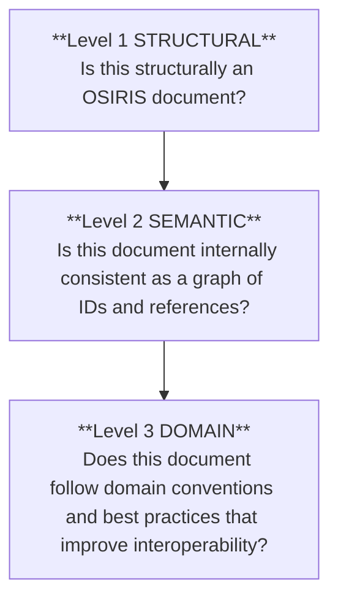

# OSIRIS JSON Validation Levels Guidelines<!-- omit in toc -->
| Field     | Value |
| --------- | ----- |
| Authors   | Tia Zanella [skhell](https://github.com/skhell) |
| Revision  | 1.0.0-DRAFT |
| Creation date      | 08 February 2026 |
| Last revision date | 11 February 2026 |
| Status    | Draft |
| Document ID | OSIRIS-ADG-VL-1.0 |
| Document URI | [OSIRIS-ADG-VL-1.0](https://github.com/osirisjson/osiris/tree/main/docs/guidelines/v1.0/OSIRIS-VALIDATION-LEVELS.md) |
| Document Name | OSIRIS JSON Validation Levels Guidelines |
| Specification ID | OSIRIS-1.0 |
| Specification URI | [OSIRIS-1.0](https://github.com/osirisjson/osiris/tree/main/specification/v1.0/OSIRIS-JSON-v1.0.md) |
| Schema URI | [OSIRIS-1.0](https://osirisjson.org/schema/v1.0/osiris.schema.json) |
| License   | [CC BY 4.0](https://creativecommons.org/licenses/by/4.0/) |
| Repository | [github.com/osirisjson/osiris](https://github.com/osirisjson/osiris) |

# Table of Content
<!-- work in progress will be defined later -->

# 1 Hierarchy of validity
OSIRIS validation is intentionally layered: each level asserts a stronger “truth” about the document and each higher level assumes the guarantees of the levels below.

This keeps OSIRIS both safe (tools can parse and build graphs reliably) and open (unknown types/extensions remain valid and forward-compatible).

> [!NOTE]
> Normative source: Rule identifiers, meanings and baseline severities are defined by the OSIRIS JSON specification (v1.0).
> This guide defines the developer tooling model (levels, contracts, profiles) and **MUST NOT** bloat by listing every message string. Message text and remediation belong in a machine-readable Diagnostic Code Registry.

---

## 1.1. Level 1: Structural (JSON schema)
**Goal**: verify that the document conforms to the OSIRIS JSON Schema (shape, required fields, data types, formats, enums, patterns). This is the minimum bar for conformance and the entry gate for any downstream processing.

| What Level 1 guarantees if passes | What Level 1 does not guarantee by design | Normative expectations |
|---|---|---|
| The document is valid JSON and matches the required OSIRIS top-level structure (`version`, `metadata`, `topology`) | That references resolve (e.g. a connection pointing to a real resource) | Consumers **MUST** perform Level 1 validation (or equivalent structural checks) before processing |
| Fields with schema constraints (enums, patterns, formats) are structurally valid | That IDs are unique | Validation **SHOULD** run locally/offline by default to preserve privacy (avoid uploading inventories/topology) |
| Tools can safely parse the document and locate data using predictable shapes | That types are “known” or semantically appropriate. (OSIRIS explicitly supports unknown types/extensions for forward compatibility.) | - |

---

## 1.2. Level 2: Semantic (Referential integrity)
**Goal**: verify internal consistency beyond what schema can express. OSIRIS is a graph (resources, connections, groups), and Level 2 ensures that graph can be constructed safely and deterministically.

**Typical checks (illustrative, not exhaustive):**
| Referential integrity | Uniqueness | Hierarchy safety (when applicable) |
|---|---|---|
| `connections[].source` / `connections[].target` reference existing `resources[].id` | IDs are unique within their arrays (`resources`, `connections`, `groups`) | Detect cycles where a hierarchy is intended to be acyclic |
| `groups[].members[]` reference existing `resources[].id` | - | Reject invalid self-references (e.g. a group listed as its own child) |
| `groups[].children[]` reference existing `groups[].id ` | - | - |

**Philosophy of truth at Level 2:**
- Passing Level 2 means: “This document is internally coherent.”
- Failing Level 2 means: “Some parts of the graph cannot be trusted.”
Consumers **SHOULD** avoid building traversals/diagrams from broken references and **MUST** surface deterministic diagnostics. 

**Normative expectations:**
- Consumers **SHOULD** perform Level 2 validation before building graph structures
- Consumers **MUST** remain forward-compatible:
  - unknown types and extension namespaces are acceptable
  - consumers **MUST** ignore unknown fields
---

## 1.3. Level 3: Domain (Infrastructure logic)
**Goal:** provide optional, opinionated best-practice checks that improve interoperability, quality and ergonomics without changing structural conformance. Level 3 can be stricter, but it **MUST NOT** redefine what is OSIRIS.

| Level 3 IS | Level 3 IS NOT |
|---|---|
| A quality layer: modeling recommendations, taxonomy guidance, consistency hints | A CMDB replacement, a vulnerability scanner, or vendor tooling |
| A way to improve portability and UX across consumers | A reason to reject documents solely for unknown types/extensions |

**Typical checks (illustrative, not exhaustive):**
| Taxonomy awareness | Modeling quality | Safe posture hints |
|---|---|---|
| Warn when types are not from the standard OSIRIS taxonomy (while still allowing them) | Encourage using properties/extensions rather than inventing new fields. | Flag obviously risky patterns only when checks are deterministic and non-invasive (no network calls, no deep inspection of secrets beyond safe heuristics) |
| - | Hint when expected identity metadata is missing (e.g. provider.native_id when applicable). | - |

**Philosophy of truth at Level 3:**
- Passing Level 3 means: “This document is likely to interoperate well.”
- Failing Level 3 means: “This document **MAY** be harder to consume consistently.” Level 3 should guide producers toward higher-quality exports, not block the ecosystem.

---

## 1.4. Pipeline overview
Validation is executed in three stages and emits structured diagnostics that tools can present consistently (CLI, editors, CI). 

> [!NOTE]
> Back-reference: See [OSIRIS-ADG-1.0](https://github.com/osirisjson/osiris/tree/main/docs/guidelines/v1.0/OSIRIS-ARCHITECTURE.md) chapter 3 section 3.2

**Pipeline contract (conceptual):**
- Stage 1 (Level 1): JSON Schema validation
- Stage 2 (Level 2): semantic integrity (indexes + referential checks)
- Stage 3 (Level 3): domain rules (best practices)
- Emit diagnostics (code + severity + location), then present via CLI/editor/CI

**Strictness profiles (spec-defined policy concept):**
Consumers **MAY** implement configurable strictness:

- `basic`: Level 1 only
- `default`: Level 1 + Level 2
- `strict`: Level 1 + Level 2 + selected Level 3 rules

Profiles **MAY** change which checks run and how severities are mapped, but **MUST NOT** change the meaning of a rule/code. (Codes are stable facts; severity is policy.)

**Non-negotiable constraints (spec-first):**
- Validation **SHOULD** be deterministic and local/offline by default (privacy)
- Consumers **MUST** accept unknown types/extensions and ignore unknown fields (forward compatibility)